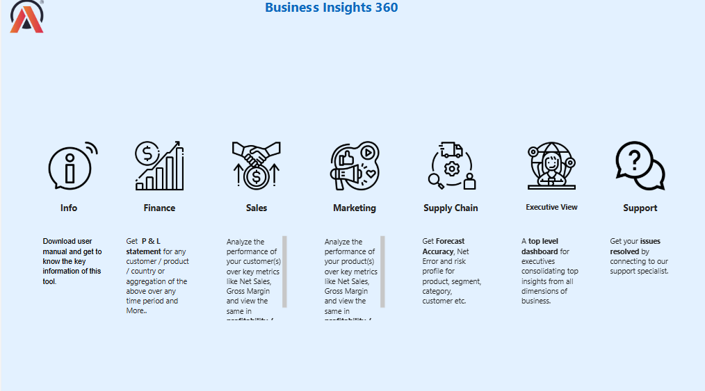
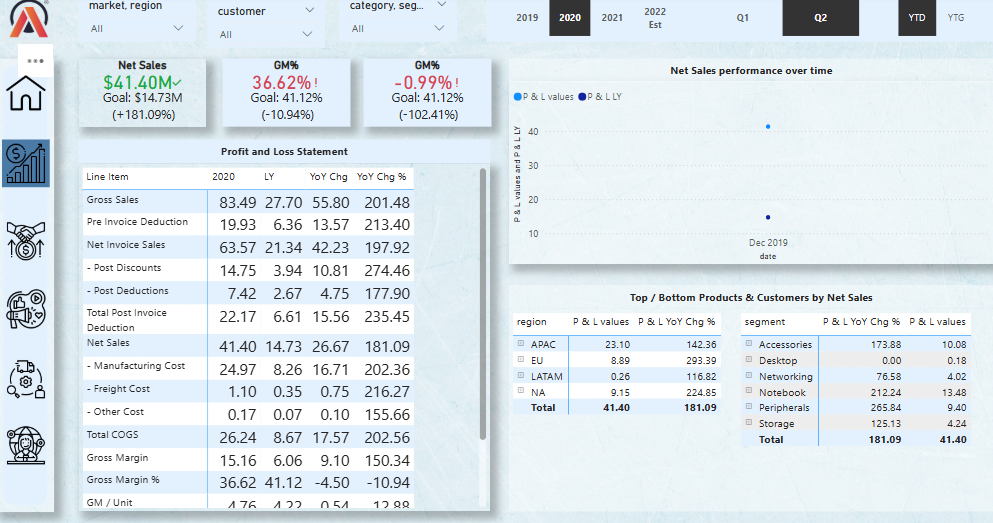
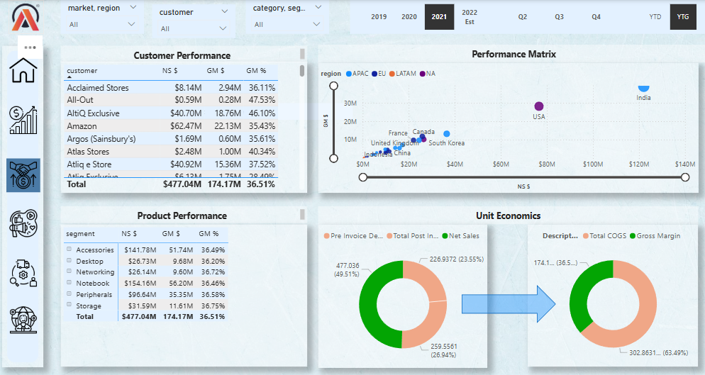
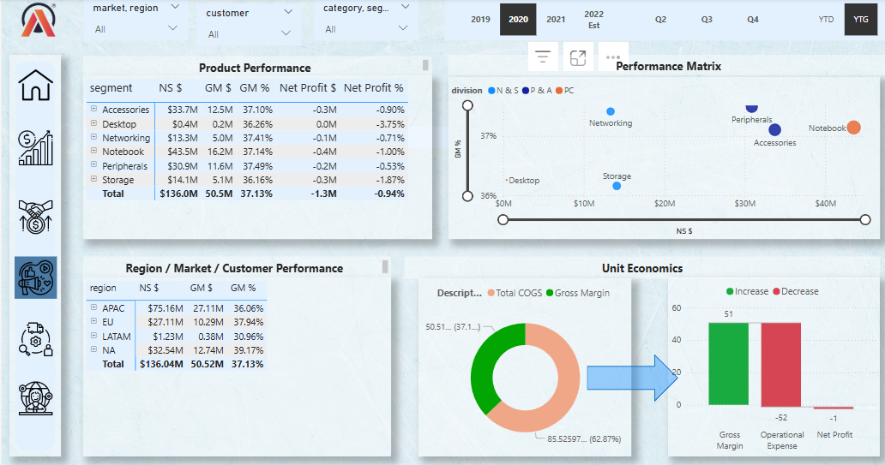
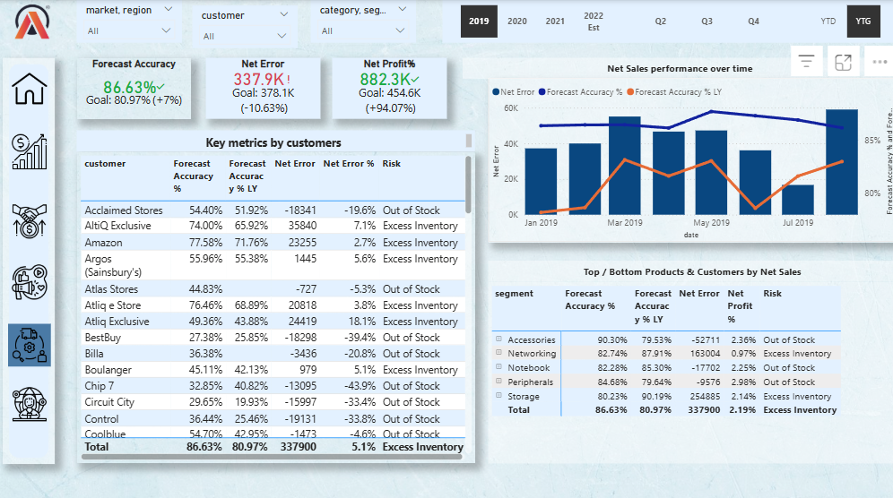
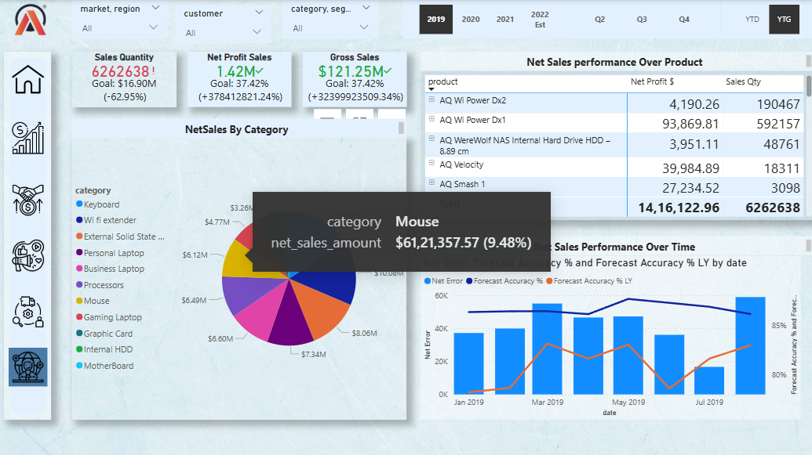

# 📊 Business Insights 360

**Business Insights 360** is a fully interactive Power BI dashboard designed to empower decision-makers with deep, actionable insights across Finance, Sales, Supply Chain, and Market Intelligence. This solution integrates executive-level KPIs with drill-down capabilities to explore data by product, region, and customer.

---

## 🧭 Dashboard Overview

### 🔹 Info Page

- Interactive welcome screen with navigation support  
- Overview of available views: Finance, Sales, Market, Supply Chain, Executive  
- Clickable icons to guide users through the dashboard experience  

---

## 💰 Finance View

- Comprehensive Profit & Loss breakdown  
- KPIs: Net Sales, Gross Margin %, Year-over-Year comparisons  
- Drill-throughs by time (Qtr/Yr/YTD/YTG), customer, product, and region  
- Goal vs Actual visual comparison to track financial performance  

---

## 📈 Sales View

- Detailed sales insights by segment, geography, and customer  
- Sales growth and profitability matrix for performance benchmarking  
- Unit economics visuals showing revenue, COGS, and margins  
- Top/bottom products and customers analysis  

---

## 🌍 Market View

- Region and division-wise performance across global markets  
- Customer-wise net sales and gross margin visualizations  
- Performance matrix for comparative country insights  
- Strategic visuals to support go-to-market planning  

---

## 🔄 Supply Chain View

- End-to-end cost tracking: Manufacturing, Freight, and Other Costs  
- Total COGS analysis and gross margin contribution  
- Cost waterfall views and impact across business units  
- Dynamic cost-to-profit tracing for each SKU/product line  

---

## 👨‍💼 Executive View

- Executive summary consolidating key business KPIs  
- High-level view of gross margin, net profit, and total COGS  
- Net profit waterfall and profitability drivers  
- Product performance matrix across divisions  

---

## 🧠 Skills Demonstrated

✅ **Power BI Expertise**  
- Advanced DAX for YoY%, Goal comparisons, custom KPIs  
- Time Intelligence (YTD, QTD, Rolling Avg, etc.)  
- Bookmarks, navigation panes & slicer panel customization  
- UX/UI-driven dashboard architecture  

✅ **Data Modeling & Transformation**  
- Efficient data modeling for performance  
- Calculated tables and relationship management  
- Multiple fact-dimension design  

✅ **Version Control & Collaboration**  
- GitHub integration and version-controlled deployment  
- Documentation with image-based navigation  
- Git LFS used for large `.pbix` files  

---

## 📦 View the Report
🔗 [**Click here to download the PBIX file**](https://app.powerbi.com/view?r=eyJrIjoiNTcyOTc2YzAtZjgxZC00ODExLWEzYjMtMzczOTg0NmI0ZTRiIiwidCI6ImM2ZTU0OWIzLTVmNDUtNDAzMi1hYWU5LWQ0MjQ0ZGM1YjJjNCJ9&pageName=3a20af4cbd4440d63e02)  
---

## 🚀 How to Use

1. Download this report  
2. Open the `.pbix` file in Power BI Desktop  
3. Use the sidebar to navigate between views  
4. Use filters to explore data across time, region, segment, and customers  

---

## 📩 Contact

I'd love to connect and collaborate!  
- 📧 Email: naveenlebaka.9082@gmail.com

---
